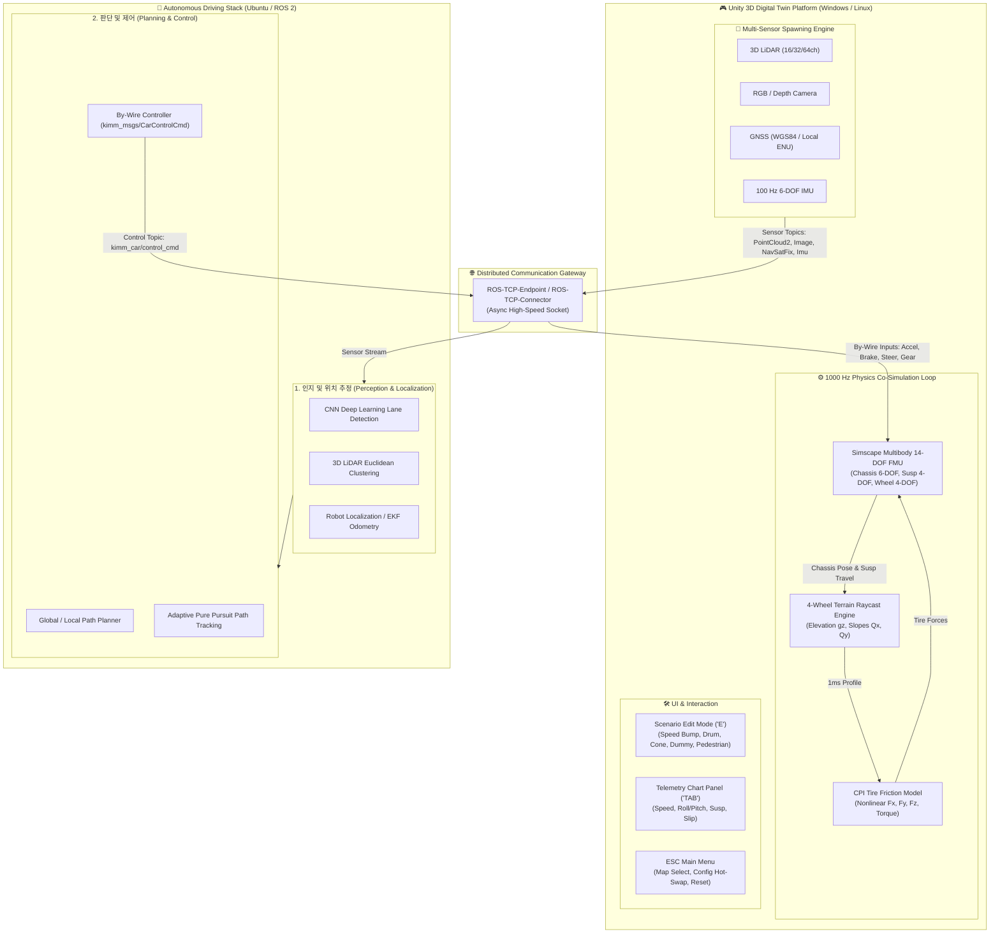

# KIMM Car Simulator

<p align="center">
  
  
  
  
  
</p>

<p align="center">
  <b>14자유도(14-DOF) 다물체 동역학 FMU 및 Unity 3D, ROS 2 기반 실시간 자율주행 차량 디지털 트윈 시뮬레이터</b><br>
  <i>An Open-Source Real-Time Autonomous Driving Digital Twin Simulator Framework Based on Simscape Multibody 14-DOF FMU, Unity 3D, and ROS 2.</i>
</p>

---

## 📑 목차 (Table of Contents)

- [개요 (Overview)](#-개요-overview)
- [주요 기능 (Key Features)](#-주요-기능-key-features)
- [시스템 아키텍처 (Architecture)](#-시스템-아키텍처-architecture)
- [시작하기 (Getting Started)](#-시작하기-getting-started)
  - [방법 A. 사전 빌드 배포본 실행 (Quick Start - Recommended)](#방법-a-사전-빌드-배포본-실행-quick-start---recommended)
  - [방법 B. 소스코드 빌드 및 개발 환경 구축 (Build from Source)](#방법-b-소스코드-빌드-및-개발-환경-구축-build-from-source)
- [ROS 2 연동 가이드 (ROS 2 Integration)](#-ros-2-연동-가이드-ros-2-integration)
- [조작 및 단축키 안내 (Controls Guide)](#-조작-및-단축키-안내-controls-guide)
- [런타임 환경설정 (Configuration & Hot-Swap)](#-런타임-환경설정-configuration--hot-swap)
- [지원 맵 및 트랙 (Supported Tracks)](#-지원-맵-및-트랙-supported-tracks)
- [기술 문서 및 연구 성과 (Documentation & Publications)](#-기술-문서-및-연구-성과-documentation--publications)
- [라이선스 (License)](#-라이선스-license)

---

## 🌟 개요 (Overview)

**KIMM Car Simulator**는 중소·중견 자동차 부품사, 스타트업 및 연구기관의 고가 외산 상용 시뮬레이터 도입 비용 부담을 덜고, 실차 수준의 고충실도 가상 검증 환경을 제공하기 위해 한국기계연구원(KIMM)에서 개발한 **오픈소스 자율주행 차량 디지털 트윈 시뮬레이터**이다.

* **1000 Hz 다물체 동역학**: MATLAB Simscape Multibody 기반 14자유도(14-DOF) 모델과 CPI(Contact Point Interface) 비선형 타이어 마찰 모델을 C++ FMU로 연동하여 1ms 무손실 실시간 연성 해석(Co-Simulation)을 수행한다.
* **센서 및 파라미터 핫스왑**: 소스코드 재컴파일 없이 JSON 파일만으로 45개 차량 물리 변수와 복수 LiDAR/Camera/GNSS/IMU 구성을 실시간 교체한다.
* **표준 ROS 2 인터페이스**: 실제 차량 By-Wire 제어 규격(`kimm_msgs/CarControlCmd`)을 통해 Ubuntu ROS 2 자율주행 풀스택(인지-판단-제어)과 1:1 직통 통신을 지원한다.

---

## ✨ 주요 기능 (Key Features)

| 분류 | 주요 기능 및 기술 스펙 |
| :--- | :--- |
| **🚗 차량 동역학** | • **14자유도 다물체 모델**: 차체 6-DOF, 4륜 독립 서스펜션 4-DOF, 휠 회전 4-DOF<br>• **CPI 타이어 모델**: 4바퀴 실시간 노면 고도/경사각 레이캐스트 및 비선형 구동/제동/코너링 포스 계산<br>• **1000 Hz Co-Simulation**: FMI 2.0 표준 C++ 바이너리 기반 1ms 결정론적 연성 해석 |
| **📡 센서 스위트** | • **3D LiDAR**: 16/32/64채널 병렬 레이캐스트 및 `sensor_msgs/PointCloud2` 발행<br>• **HD Camera**: RGB 전/후방/어라운드뷰 렌더 텍스처 및 `sensor_msgs/CompressedImage` 스트리밍<br>• **GNSS & IMU**: WGS84 위경도 변환(`NavSatFix`) 및 100Hz 6축 관성 센서 데이터(`Imu`) |
| **🌐 통신 및 연동** | • **ROS 2 By-Wire 인터페이스**: `kimm_msgs/CarControlCmd` (가속, 제동, 조향, 기어)<br>• **비동기 TCP 게이트웨이**: `ROS-TCP-Endpoint` 기반 다중 스레드 고속 통신 |
| **🛠️ 사용자 편의 기능** | • **실시간 텔레메트리 차트 (`TAB`)**: 속도, 롤/피치각, 서스펜션 변위, 슬립률 동적 시각화<br>• **인터랙티브 시나리오 편집 모드 (`E`)**: 주행 정지 후 과속방지턱, 드럼통, 더미차량, 동적 보행자 실시간 배치<br>• **ESC 시스템 메뉴**: 맵 전환, 파일 탐색기 기반 차량/센서 JSON 즉시 핫스왑 |

---

## 🏛️ 시스템 아키텍처 (Architecture)



---

## 🚀 시작하기 (Getting Started)

### 시스템 요구 사양 (System Requirements)

* **운영체제**: Windows 10/11 (64-bit) 또는 Ubuntu 20.04/22.04 LTS
* **CPU**: Intel Core i5-12세대 이상 / AMD Ryzen 5 5600 이상 권장
* **GPU**: NVIDIA GeForce RTX 3060 이상 (RTX 4060 Ti / 5060 Ti 권장, VRAM 8GB 이상)
* **메모리**: 16 GB RAM 이상
* **소프트웨어**: Unity 2022.3 LTS (소스 빌드 시), ROS 2 Humble 또는 Foxy (자율주행 연동 시)

---

### 방법 A. 사전 빌드 배포본 실행 (Quick Start - Recommended)

소스코드 빌드 없이 시뮬레이터를 즉시 실행하려면 사전 빌드 패키지를 사용한다:

1. 저장소 우측의 **[Releases](https://github.com/dbsrn0125/Kimm-Car-Simulator/releases)** 페이지에서 최신 배포본(`Kimm-Car-Simulator_v2.0.0_Windows_x64.zip`)을 다운로드한다.
2. 다운로드한 파일의 압축을 해제한다.
3. **`Kimm-Car-Simulator.exe`** 를 더블클릭하여 실행한다.
4. `W/A/S/D` 키보드 또는 레이싱 휠을 사용하여 가상 트랙 주행을 즉시 시작할 수 있다.

---

### 방법 B. 소스코드 빌드 및 개발 환경 구축 (Build from Source)

시뮬레이터 프로젝트를 직접 수정하거나 Unity 에디터에서 실행하는 경우:

1. **저장소 클론**:
   ```bash
   git clone https://github.com/dbsrn0125/Kimm-Car-Simulator.git
   cd Kimm-Car-Simulator
   ```
2. **Unity Hub에서 프로젝트 열기**:
   * Unity Hub 실행 ➔ `Add` ➔ 클론받은 `Kimm-Car-Simulator` 폴더 선택.
   * 에디터 버전: **Unity 2022.3.x LTS** 선택 후 실행.
3. **메인 씬 열기**:
   * `Project` 창 ➔ `Assets/Scenes/` ➔ **`Proving Ground`** (또는 `K-City`, `Mcity`, `Zalazone`) 더블클릭.
4. **에디터 실행**:
   * 상단 중앙의 **`Play (▶)`** 버튼 클릭.
5. **독립 실행 파일 빌드 (Standalone Build)**:
   * 상단 메뉴 `File` ➔ `Build Settings...` ➔ 플랫폼: `Windows, Mac, Linux` (Target: Windows, x86_64).
   * `Build` 버튼 클릭 후 원하는 출력 디렉토리 지정.

---

## 🌐 ROS 2 연동 가이드 (ROS 2 Integration)

Ubuntu 22.04 (또는 WSL 2) 환경의 ROS 2 자율주행 알고리즘과 통신하는 절차이다.

### 1. Ubuntu 환경 의존성 설치 및 워크스페이스 빌드
```bash
# ROS 2 및 TCP Endpoint 워크스페이스 생성
mkdir -p ~/kimm_ws/src
cd ~/kimm_ws/src

# ROS-TCP-Endpoint 및 커스텀 메시지 패키지 클론
git clone https://github.com/Unity-Technologies/ROS-TCP-Endpoint.git
git clone https://github.com/dbsrn0125/Kimm-Car-Simulator.git

# 워크스페이스 빌드
cd ~/kimm_ws
source /opt/ros/humble/setup.bash
colcon build
source install/setup.bash
```

### 2. ROS-TCP-Endpoint 통신 서버 실행
```bash
# TCP 서버 가동 (포트 10000)
ros2 run ros_tcp_endpoint default_server_endpoint --ros-args -p ROS_IP:=0.0.0.0 -p ROS_PORT:=10000
```

### 3. 시뮬레이터 연결 및 자율주행 제어
1. Windows에서 `Kimm-Car-Simulator.exe` 실행.
2. 화면 상단 HUD의 ROS 2 연결 표시기가 **초록색 (Connected)** 으로 활성화되는지 확인.
3. 키보드 **`M` 키**를 눌러 제어 모드를 **`AUTO MODE`** 로 전환.
4. Ubuntu 터미널에서 자율주행 경로 추종 노드 실행:
   ```bash
   ros2 run kimm_car_control pure_pursuit_node
   ```

---

## 🎮 조작 및 단축키 안내 (Controls Guide)

### 4.1 키보드 조작 (Keyboard Controls)

| 키 (Key) | 기능 (Function) | 상세 설명 |
| :---: | :--- | :--- |
| **`W` / `S`** | **가속 / 감속 (Throttle / Brake)** | 차량 종방향 가속 및 유압 제동 |
| **`A` / `D`** | **조향 (Steering Left / Right)** | 전륜 조향각 제어 |
| **`Shift` / `Ctrl`** | **기어 전진 / 후진 (Drive / Reverse)** | `Shift`: 전진(D) 기어 체결 / `Ctrl`: 후진(R) 기어 체결 |
| **`P`** | **파킹 기어 (Park)** | 주차(P) 기어 체결 (`gear: 0`) |
| **`M`** | **수동 / 자율 모드 전환 (Manual ↔ Auto)** | 운전자 수동 주행과 ROS 2 자율주행 제어권 1:1 토글 |
| **`R`** | **차량 위치 리셋 (Reset Vehicle)** | 현재 맵의 최초 시작 스폰 위치로 즉시 재배치 |
| **`E`** | **인터랙티브 시나리오 편집 모드 토글** | 주행 정지 후 장애물/보행자 마우스 배치 모드 진입 |
| **`TAB`** | **실시간 텔레메트리 차트 토글** | 속도, 롤/피치, 서스펜션 변위, 슬립률 그래프 오버레이 |
| **`ESC`** | **메인 시스템 메뉴 열기 / 닫기** | 맵 전환, 차량/센서 JSON 핫스왑, 설정 팝업 |
| **`F1`** | **조작 도움말 팝업 토글** | 전체 키 매핑 및 휠 조작 안내창 표시 |
| **`F5` ~ `F8`** | **시점 전환 (Camera Views)** | `F5`: 1인칭/3인칭, `F6`: 탑뷰, `F7`/`F8`: 좌/우 사이드뷰 |

### 4.2 USB 레이싱 휠 & 게임패드 매핑 (Racing Wheel Mapping)

* **스티어링 휠 / 페달**: 아날로그 조향각 및 가속(Gas) / 제동(Brake) 페달 답력 비례 제어 (0 ~ 100%)
* **패들 시프트**: 우측 패들(D 기어 체결) / 좌측 패들(R 기어 $\leftrightarrow$ P 기어 순환)
* **버튼 매핑**:
  * 🔵 **`A` 버튼 (South)**: 수동 ↔ 자율주행 모드 전환 (`M` 키 동일)
  * 🔴 **`B` 버튼 (East)**: 차량 위치 리셋 (`R` 키 동일)
  * 🟢 **`X` 버튼 (West)**: HUD 미니 뷰포트 시점 변경
  * 🟡 **`Y` 버튼 (North)**: 맵 순환 로딩 (`PG ➔ K-City ➔ Mcity ➔ ZalaZone`)
  * **십자키 (D-Pad)**: 상/하/좌/우 카메라 뷰 즉시 전환

---

## ⚙️ 런타임 환경설정 (Configuration & Hot-Swap)

설정 파일은 실행 파일 기준 `Kimm-Car-Simulator_Data/StreamingAssets/` 폴더에 위치하며, 소스코드 수정 없이 JSON 수정만으로 동작이 변경된다.

### 1. 차량 물리 파라미터 (`VehicleConfigs/vehicle_config.json`)
* 총 45개의 차량 물리 변수를 포함한다 (차체 질량 `Veh_BodyMass`, 3축 관성모멘트 `Veh_BodyInertia`, 전후륜 트랙폭 `Veh_TrackF/R`, 축거 `Veh_Front/RearAxleX`, 서스펜션 스프링/댐퍼 강성 `Veh_SuspF/R_*`, 공력 계수 `Veh_Aero*` 등).

### 2. 센서 스위트 파라미터 (`SensorConfigs/custom_sensor_config.json`)
* 단수형 키(`"LiDAR"`, `"Camera"`, `"GNSS"`, `"IMU"`) 배열 구조를 채택하여 런타임에 다중 센서를 동적으로 스폰한다:
```json
{
  "LiDAR": [
    {
      "name": "front_lidar",
      "topic": "/kimm_car/lidar/front/points",
      "frame_id": "front_lidar_link",
      "channels": 32,
      "range": 100.0,
      "frequency": 10.0,
      "position": [0.0, 1.8, 1.2],
      "rotation": [0.0, 0.0, 0.0]
    }
  ],
  "Camera": [
    {
      "name": "front_camera",
      "topic": "/kimm_car/camera/front/image_compressed",
      "frame_id": "front_camera_link",
      "width": 1280,
      "height": 720,
      "fov": 70.0,
      "frequency": 30.0,
      "position": [0.0, 1.6, 1.5],
      "rotation": [0.0, 0.0, 0.0]
    }
  ]
}
```

---

## 🗺️ 지원 맵 및 트랙 (Supported Tracks)

| 맵 명칭 (Track Name) | 특징 및 환경 구성 | 권장 테스트 시나리오 |
| :--- | :--- | :--- |
| **Proving Ground (PG)** | 평탄한 다목적 차량 종합 성능 시험장 및 직선/선회로 | 차량 14-DOF 동역학 한계 거동, 급가속/급제동, 서스펜션 튜닝 |
| **K-City (자율주행 실험도시)** | 한국교통안전공단(KATRI) 실도로 기반 교차로, 건물, 터널 트랙 | 차선 인식, 3D LiDAR 장애물 회피, 도심 신호 교차로 주행 |
| **Mcity (도심 자율주행 트랙)** | 도심형 인터체인지 및 복합 도로 환경 트랙 | 복합 교차로 회전, 다중 보행자/더미차량 돌발 상황 검증 |
| **ZalaZone (자라존 시험장)** | 유럽형 스마트시티 및 고속 핸들링/선회 시험 트랙 | 고속 자율주행 경로 추종, 복합 슬라럼 및 횡방향 핸들링 검증 |

---

## 📜 기술 문서 및 연구 성과 (Documentation & Publications)

* 📖 **[공식 기술 및 사용자 매뉴얼 (User & Technical Manual)](https://github.com/dbsrn0125/Kimm-Car-Simulator/blob/main/docs/KIMM_Car_Simulator_Official_Manual.md)**
* 🏛️ **[시스템 아키텍처 백서 (System Architecture Whitepaper)](https://github.com/dbsrn0125/Kimm-Car-Simulator/blob/main/docs/26KimmDgtTwin_Architecture.md)**
* 🎓 **KSAE 2024 학술대회 논문**: *"Simscape Multibody 14자유도 FMU와 Unity 3D 및 ROS 2 기반 실시간 자율주행 차량 디지털 트윈 시뮬레이터 개발"*

---

## 👥 연구진 및 라이선스 (Team & License)

* **연구 개발 기관**: 한국기계연구원 (KIMM) 가상공학플랫폼연구본부 디지털트윈연구실
* **라이선스**: 본 프로젝트는 [MIT License](LICENSE)에 따라 배포됩니다.
